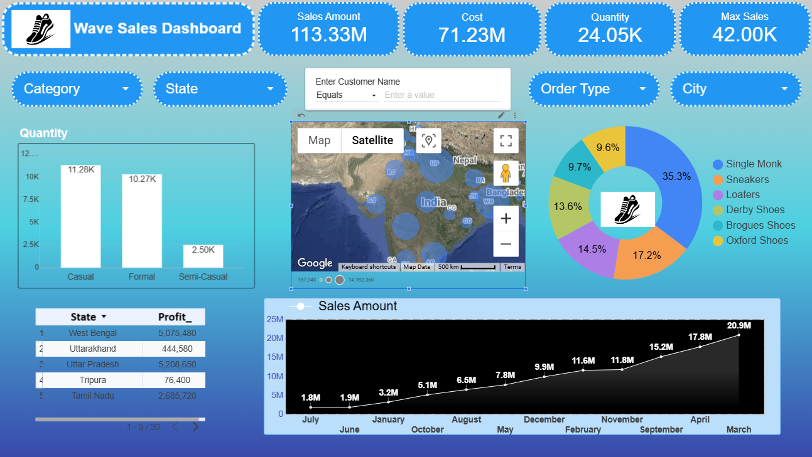

# 📊 Customer Churn Dashboard – Looker Studio

## 🔍 Project Overview
This is an interactive dashboard created using **Google Looker Studio** to visualize and analyze customer churn patterns. The dashboard provides a clear overview of key metrics and allows users to explore churn behavior through dynamic filters.

---

## 🎯 Dashboard Objectives
- Identify churn trends across demographics
- Analyze customer segments by gender, age group, and other factors
- Present data through clean, professional visuals for strategic insights
- Enable interactivity to support exploratory analysis

---

## 🛠️ Tools & Technologies
- Google Looker Studio
- Google Sheets (for data staging and cleaning)

> ⚠️ **Note**: Dataset is internal and not publicly available.

---

## 📷 Dashboard Preview

| Overview |
|----------|
|  |

---

## 🔗 Live Dashboard Link
👉 [Click here to view the dashboard](https://lookerstudio.google.com/s/g_Wisr_sEX0)

---

## 📄 PDF Report
Available on request

---

## 👨‍💻 Author
**Sumit Agnihotri**  
Aspiring Data Scientist | BCA (Data Science)  
[LinkedIn](https://www.linkedin.com/in/sumit-agnihotri/)